Title: Terraform-Github-Actions-OIDC
Overview: Implemenenting Cloud Infrastructure through Terraform and creating automated Github workflow.
Security Problem: 
Give the remote Github Actions AWS credentials while reducing the risk of it being compromised from a remote third party server, while applying least privelege by giving GitHubActions only permissions it needs.

```mermaid
flowchart TD

    REPO["GitHub Repository"]

    REPO --> FEATURE["Feature Branch"]
    REPO --> MANUAL["Manual Dispatch"]
    REPO --> SCHEDULE["Daily Schedule"]

    %% =========================
    %% PULL REQUEST / DEPLOYMENT PATH
    %% =========================

    FEATURE --> PUSH["git push"]
    PUSH --> PR["Pull Request → main"]

    PR --> PRCHECK["PR Check"]

    PRCHECK --> PRCHECKOUT["Checkout Repository"]
    PRCHECKOUT --> DETECT["Detect PROD Changes"]
    DETECT --> PRSETUP["Setup Terraform"]
    PRSETUP --> PROIDC["GitHub OIDC → AWS STS → Plan Role"]

    PROIDC --> DEVPR["DEV<br/>fmt → init → validate → Checkov → plan"]

    DEVPR --> PRODCHANGED{"PROD Changed?"}
    PRODCHANGED -- No --> PASS["PR Checks Pass"]
    PRODCHANGED -- Yes --> PRODPR["PROD<br/>init → validate → Checkov → plan"]
    PRODPR --> PASS

    PASS --> MERGE["Merge PR → main"]
    MERGE --> MAINPUSH["Push Event on main"]

    MAINPUSH --> FILTER["Path Filter<br/>DEV / PROD / Shared Modules"]

    %% =========================
    %% DEV DEPLOYMENT
    %% =========================

    FILTER --> DEV["DEV"]

    DEV --> DEVCHECKOUT["Checkout + Setup Terraform"]
    DEVCHECKOUT --> DEVPLANROLE["GitHub OIDC → AWS STS → Plan Role"]
    DEVPLANROLE --> DEVSCAN["fmt → init → validate → Checkov"]
    DEVSCAN --> DEVPLAN["Terraform Plan"]
    DEVPLAN --> DEVCHANGE{"Changes Found?"}

    DEVCHANGE -- No --> DEVEND["DEV Complete"]
    DEVCHANGE -- Yes --> DEVAPPLYROLE["GitHub OIDC → AWS STS → Apply Role"]
    DEVAPPLYROLE --> DEVAPPLY["Terraform Apply"]
    DEVAPPLY --> DEVEND

    %% =========================
    %% PROD DEPLOYMENT
    %% =========================

    DEVEND --> PROD["PROD"]

    PROD --> PRODCHECKOUT["Checkout + Setup Terraform"]
    PRODCHECKOUT --> PRODPLANROLE["GitHub OIDC → AWS STS → Plan Role"]
    PRODPLANROLE --> PRODSCAN["fmt → init → validate → Checkov"]
    PRODSCAN --> PRODPLAN["Terraform Plan"]
    PRODPLAN --> PRODCHANGE{"Changes Found?"}

    PRODCHANGE -- No --> PRODEND["PROD Complete"]
    PRODCHANGE -- Yes --> PRODAPPLYROLE["GitHub OIDC → AWS STS → Apply Role"]
    PRODAPPLYROLE --> PRODAPPLY["Terraform Apply"]
    PRODAPPLY --> PRODEND

    PRODEND --> AWS["AWS Infrastructure"]

    %% =========================
    %% MANUAL DISPATCH
    %% =========================

    MANUAL --> MANUALTYPE{"Action"}
    MANUALTYPE --> PLANDEV["plan-dev"]
    MANUALTYPE --> APPLYDEV["apply-dev"]

    PLANDEV --> DEV
    APPLYDEV --> DEV

    %% =========================
    %% SCHEDULED DRIFT
    %% =========================

    SCHEDULE --> DEVDRIFT["DEV Drift"]
    SCHEDULE --> PRODDRIFT["PROD Drift"]

    DEVDRIFT --> DEVDRIFTAUTH["OIDC → Plan Role"]
    DEVDRIFTAUTH --> DEVDRIFTPLAN["init → plan"]
    DEVDRIFTPLAN --> DEVDRIFTSUM["DEV Drift Summary"]

    PRODDRIFT --> PRODDRIFTAUTH["OIDC → Plan Role"]
    PRODDRIFTAUTH --> PRODDRIFTPLAN["init → plan"]
    PRODDRIFTPLAN --> PRODDRIFTSUM["PROD Drift Summary"]

    %% =========================
    %% REMOTE STATE
    %% =========================

    STATE[("S3 Remote Backend<br/>Remote State + State Locking")]

    STATE -.-> DEVSCAN
    STATE -.-> PRODSCAN
    STATE -.-> DEVDRIFTPLAN
    STATE -.-> PRODDRIFTPLAN
```

### Pull Request Pipeline (merge with the new version)

 A git push from a feature branch triggers the computer to start the workflow. GitHubActions is granted permissions to request an OIDC token from GitHub. Then it's granted permission to read the files save in Terraform-Github-Actions-OIDC repository. It starts running on latest version of Ubuntu. It requests an AssumeRoleWithIdentity to the IAM role GitHubActionsTerraformRole. It provides an ID token from Github OIDC provider in the request, to AWS STS. 

 It first checks if the Terraform-Github-Actions-OIDC repository is formatted correctly. 

Then it intializes the S3 Backend in versions.tf and downloads the AWS provider that it can communicate to the cloud, such as creating resources or API calls. 

After initiliation it validates the code if it's written in correct Terraform syntax and that it's readable, then creates a plan of the new version of the cloud infrastructure. It contains what changes will be made, such as what resources will be destroyed or added, which I can view in the workflow logs. Finally it applies the changes, using that Terraform plan, updating the cloud infrastructure in AWS.

## Pull Request Pipeline

A git push from a feature branch triggers the computer to start the workflow. GitHubActions is granted permissions to request an OIDC token from GitHub. Then it's granted permission to read the files saved in the Terraform-Github-Actions-OIDC repository. It starts running on the latest version of Ubuntu. The default directory it runs its commands in is set at terraform/environments/dev. The computer then accesses GitHub's Action's organization and 'checkout', the repository inside that contains the code for the runner. 

it compares the files of the current Git branch against the files of the feature branch that’s trying to merge. If it detects any changed files it will print it in the GitHubActions log. Then it checks if the changed files were in Dev, Prod, or Modules. If there’s a change to any of these files, it will begin a series of terraform checks. 

First it authenticates itself, requesting the GitHub OIDC provider to give it an OIDC token. In the token request, the workflow provides the specific role it wants to assume and the US region it is located in. Then the OIDC provider returns a token back to the GItHubActions computer. “Configure-aws-credentials” then calls AssumeRoleWithWebIdentity, sending that token to AWS STS, the audience. AWS STS verifies the token by checking the trust policy of the role it wants to assume. Inside the trust policy, has conditionals that the token has to match, such as the audience (Which is AWS STS), and the subject, which includes the repository and the environment that is requesting the role. If the conditions match inside the token, AWS STS verifies the computer and lets it assume the AWS role.

For this part of the workflow, GItHubActions only assumes the plan role for the pull request. It downloads GitHub's Action's organization and 'checkout', the repository inside that contains the code for the runner. Next it installs Terraform onto itself, so it can read and write in Terraform code.

The workflow verifies its format, the initialization, validation of code, and if it passes the checkov scan. Finally it performs a terraform plan to see what changes it would make to the AWS infrastructure, if any. 

If the directory passes all the checks, the pull request is successful and can be merged safely in the main branch. Once it’s merged, the same checks are performed again, as this is an entirely new workflow and has no recollection of change detection in the PR check. If it detects a  change in the Dev and Prod environments without a change in Modules, it will perform terraform checks, until terraform plan, where it will first assume the AWS Plan Role. If authenticated successfully it will perform a terraform plan. If there are any changes to be made in the AWS infrastructure, the workflow will then attempt to assume the ApplyRole. If authentication is successful, it will then perform Terraform Apply. 

If a change was made to modules, the change will go through dev first, and if the change is successful the GitHubActions workflow will ask the required reviewer if it would like to apply the same changes to Prod. If approved the changes will be applied to Prod. 

## Schedule Pipeline 
The Schedule pipeline is very similar to the PR/Git Push Pipeline. A scheduled action triggers the computer to start the workflow. GitHubActions is granted permissions to request an OIDC token from GitHub. Then it's granted permission to read the files saved in the Terraform-Github-Actions-OIDC repository. It starts running on the latest version of Ubuntu. The default directory it runs its commands in is set at terraform/environments/dev. The computer then accesses GitHub's Action's organization and 'checkout', the repository inside that contains the code for the runner. 

It begins a series of terraform checks. The workflow verifies its format, the initialization, validation of code, and if it passes the checkov scan. Finally it performs a terraform plan to see what changes it would make to the AWS infrastructure. If there’s a difference between the current AWS infrastructure and the desired infrastructure it will print “Changes detected” message in the GitHubActions log, then provide a Drift summary of what changes would be made from the Terraform Plan Log.

On a pull request, push request, or a manual workflow dispatch,

## Technologies Used

- Terraform
- GitHub Actions
- GitHub OIDC
- Checkov
- AWS Identity and Access Management (IAM)
- AWS Security Token Service (STS)
- AWS CloudTrail
- Amazon S3
- Amazon VPC
- AWS Key Management Service (KMS)
- Amazon CloudWatch

## Terraform

The programming language used to code the AWS infrastructure and call API's.

## GitHub Actions

A temporary computer  created by a trigger in Github that automates tasks in terraform's YML file.

## OIDC

Used OpenIDConnect protocol through Github that let's GitHUb Actions prove it's identity to AWS, using short term OIDC ID tokens that are frequently regenerated. This is to prevent long term credentials stored in a third party service like Github, encase a leak occurs or to prevent stolen credentials being used.

## IAM OIDC Provider

This is the IAM Resource that the Role's trust policy points to. It contains the url of the OIDC Token Provider, which in this project is GitHub's OIDC Token Provider. It gholds the intended audience of the OIDC token.

## AWS STS

AWS Security Token Service in this project was used to verify the OIDC ID Token provided by GitHubActions, and to allow it to assume the AWS Role and to provide credentials to call API's.

## IAM Trust Policy

The IAM Trust Policy of GitHubActionsTerraform Role includes conditions it expects the OIDC token to have, such as a specific subject (the repository and branch the GitHubActions is working from) and audience (recipient of token) of the OIDC token. In this case the subject was the Github Repository terraform-github-actions-oidc and the audience is AWS STS.

## IAM Permissions Policy
I applied principle of least privilege when setting up the IAM Permissions Policy of the IAM roles GitHubActionsTerraformPlan Role and GitHubActionsTerraformApply Role. The Plan role only has permissions to call APIs only for reading and listing AWS objects and resources. The Apply Role, in addition to reading and listing, also has permissions to call APIs that involve writing, so the role is able to create resource and objects if neccessary.

## Plan Role vs Apply Role

The Plan Role is called upon during the Pre-Merge Workflow (Pull Request) and the Post-Merge Workflow (the Git push into main branch). It performs Terraform fmt check, Terraform Validate, and Terraform Plan. Only in the post-merge, the GitHubActions computer assumes the Apply Role to apply changes to AWS infrastructure, if new Terraform code has been introduced to the AWS Infrastrcture.  

## Checkov 

A Checkov Scan is ran during the Pull Request workflow and the Merge workflow. It checks if the required Terraform configuration and resources are implemented in the Dev, Prod, and Modules directory.

## Amazon VPC

A network where AWS resources are deployed and can communicate with eachother. It can be divided into multiple subnets, such as private subnets and public subnets. It can also contain route tables where it directs where traffic can be sent within the network. In my project, traffic coming from my public subnet and to my public subnet is configured to travel through my Internet Gateway, which provides a connection to the internet and the network.

## Amazon S3

Amazon S3 provides the proper infrastructure and configuration for S3 buckets, which are used to store, and protect files and data stored in them. For instance, once a S3 BUcket is made, you can make the S3 resource of PublicAccessBlock to configure what the public internet may have access towards the bucket.

## Amazon KMS

Used to create and manage a customer-managed encryption key for encrypting data stored in the S3 Buckets. This was implemented for the Checkov security remediation. My S3 buckets use  SSE-KMS  envelope encryption. The object is encrypted with a data key, while KMS protects the data key using a KMS key. This allows access to the encryption key to be controlled separately through IAM and KMS policies. SSE-KMS stands for Server-Side Encryption with AWS Key Management Service keys. It encrypts the data after the resource receives it, rather than it is encrypted before being uploaded to the cloud.

## Amazon Cloudwatch

Logs from the VPC network were directed to AWS cloudwatch for recording and monitoring traffic flowing from and to the VPC network.

## Least Privelege Design Decisions

The project follows the principle of least privilege by separating Terraform planning and deployment permissions. Workflow operations such as Terraform plans and scheduled drift detection use a dedicated Plan Role with permissions needed to inspect infrastructure. Deployment operations use a separate Apply Role with the additional permissions required to create, modify, or delete managed AWS resources. In GitHub Actions, the workflow is permitted to execute in certain Github environments, such as Dev or Prod, if any changes are made to them. If it's permitted, it will then ask the viewer first to allow the workflow to proceed in the permitted environment. 

## Major IAM Permissions

### VPC / Networking Permissions

Permissions to create EC2 resources for VPC network such as CreateVpc and CreateSecurityGroups.

### S3 Permissions

Permissions to create S3 resources such as buckets and to modify it's properties such as encryption, and public access settings. Also to manage objects in buckets. Following example permissions are: CreateBucket and PutEncryptionConfiguration.

### Read Permissions

Permissions to retrieve existing resources of AWS infrastructure and objects inside. Primarily to compare existing AWS infrastructure to desired infrastructure when running "terraform plan" and "terraform apply". Following Example permissions are: GetBucketAcl, GetBucketLogging, GetObject.

## State Design

Terraform state is stored remotely in the terraform-oidc-state-aidan S3 bucket as an object with the key terraform.tfstate using the S3 backend.

### State Locking

State locking is a configuration in the backend. It’s default value is false, but if you make it true, it prevents access or changes to the state occurring at the same time. Whenever someone is performing terraform plan or terraform apply, they will acquire a lock. If another persoon or computer tried to perform the same operations they will receive an error say they cannot perform that operation. It’s only until the original operation is done, it will release the lock, allowing another person or computer to access the state for a terraform operation.  

### Why S3:ListBucket for State Backend

Backend needs ListBucket to know what workspaces it manages. For instance if anyone wanted to list, delete, or add to the workspaces, the back end needs to access the list of workspaces, to see if a workspace that is being deleted exists, or if a workspace beingg created does not exist yet.

## Infrastructure Security Scanning

Checkov is integrated into the GitHub Actions pipeline to scan Terraform
configuration for security misconfigurations before deployment.

Several findings were remediated during development, including improvements
to S3 encryption, access logging, lifecycle configuration, and VPC Flow Logs.

### Intentional Suppressions

- `CKV2_AWS_62` — S3 Event Notifications
  - These buckets do not need to trigger another service when objects change.

- `CKV_AWS_144` — S3 Cross-Region Replication
  - This project does not require copies of S3 data in another AWS region.

- `CKV2_AWS_5` — Security Group Attached to a Resource
  - The project creates the security group as part of the network architecture
    but does not deploy a resource that needs to use it.

## Security Controls

- **OIDC Federation** — Eliminates long-lived AWS access keys in GitHub by exchanging GitHub OIDC identity tokens for temporary AWS credentials.

- **Restricted IAM Trust Policies** — Limits role assumption to approved GitHub repository/workflow identities and validates the expected OIDC audience.

- **Plan/Apply Role Separation** — Planning and drift detection use a less-privileged Plan Role, while deployment permissions are available only through the Apply Role.

- **Least-Privilege IAM Permissions** — IAM permissions are limited to the AWS operations required by Terraform.

- **Pull Request Validation** — Terraform formatting, validation, Checkov scanning, and planning run before infrastructure changes are merged.

- **Checkov IaC Security Scanning** — Terraform configurations are statically scanned for security misconfigurations before deployment.

- **Path-Based Deployment Routing** — DEV, PROD, and shared module changes are detected separately so only affected environments proceed through the appropriate workflow path.

- **DEV → PROD Module Validation** — Changes to shared modules are validated against DEV before PROD is allowed to proceed.

- **Saved Terraform Plans** — Deployment uses the same `tfplan` generated during the plan stage rather than generating a different plan immediately before apply.

- **Scheduled Drift Detection** — DEV and PROD run scheduled `terraform plan` checks using the Plan Role. Differences are reported without being automatically applied.

- **Required Viewers** - When a workflow is about to be deployed in an environment, such as dev or prod, it requires the approval of an required viewer.

- **Protection from main** - Modifications to the repository cannot come from pushes from the main branch. They must be merged from PR’s, so it can be validated through a series of checks and follow specific deployment configuration.

## How to Run THe Project

Go to the Github repository 'terraform-github-actions-oidc'. Click the actions tab, then click on .github/workflows/terraform.yml workflow tab. From there, you should see button that says "Run workflow." This executes the workflow process on the Github repository. If any of the checks fail, it will show you a failed workflow with a red "X". If all the checks succeeded, it it will show you a succesful workflwo with a green check. After a workflwo is finished, you can click on the specific workflow and see what code the computer ran, directed by the steps in terraform.yml. If it was an unsuccessful workflow, you can see which step it failed.

## Limitations

- **AWS Only** — The project currently supports AWS and does not demonstrate deployment across multiple cloud providers.

- **Limited Infrastructure Scope** — The Terraform configuration deploys a relatively small set of AWS resources and does not represent the complexity of a large production environment.

- **No Application Deployment** — The pipeline focuses on infrastructure provisioning and security rather than deploying and operating an application workload.

- **Portfolio/Test Environment** — The project demonstrates secure infrastructure deployment patterns but is not designed as a complete production platform.

## Future Improvements

- [ ] Add cost estimation to the CI/CD pipeline
- [ ] Add AWS Config for continuous resource compliance monitoring
- [ ] Add deployment notifications for successful or failed infrastructure changes
- [ ] Add policy-as-code enforcement with a tool such as OPA/Conftest
- [ ] Add rollback and disaster recovery documentation
- [ ] Expand the project to support additional AWS services and more complex infrastructure