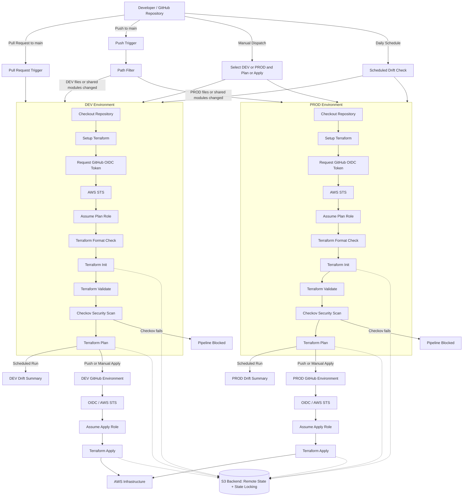

Title: Terraform-Github-Actions-OIDC
Overview: Implemenenting Cloud Infrastructure through Terraform and creating automated Github workflow.
Security Problem: 
Give the remote Github Actions AWS credentials while reducing the risk of it being compromised from a remote third party server, while applying least privelege by giving GitHubActions only permissions it needs.

### Pipeline

On a pull request, push request, or a manual workflow dispatch, it triggers the computer to start the workflow. First it waits for the required viewer to give permission to run the workflow. If approved, GitHubActions proceeds. GitHubActions is granted permissions to request an OIDC token from GitHub. Then it's granted permission to read the files save in Terraform-Github-Actions-OIDC repository. It starts running on latest version of Ubuntu. It requests an AssumeRoleWithIdentity to the IAM role GitHubActionsTerraformRole. It provides an ID token from Github OIDC provider in the request, to AWS STS. 

If authentication is successful the computer accesses GitHub's Action's organization and 'checkout', the repository inside that contains the code for the runner. Next it installs Terraform onto itself, so it can read and write in Terraform code. It first checks if the Terraform-Github-Actions-OIDC repository is formatted correctly. Then it intializes the S3 Backend in versions.tf and downloads the AWS provider that it can communicate to the cloud, such as creating resources or API calls. 

After initiliation it validates the code if it's written in correct Terraform syntax and that it's readable, then creates a plan of the new version of the cloud infrastructure. It contains what changes will be made, such as what resources will be destroyed or added, which I can view in the workflow logs. Finally it applies the changes, using that Terraform plan, updating the cloud infrastructure in AWS.

## Technologies Used

- Terraform
- GitHub Actions
- GitHub OIDC
- AWS IAM
- AWS STS
- AWS CloudTrail
- Amazon S3
- Amazon VPC

## Terraform

The programming language used to code the AWS infrastructure and call API's.

## GitHub Actions

A temporary computer  created by a trigger in Github that automates tasks in terraform's YML file.

## OIDC

Used OpenIDConnect protocol through Github that let's GitHUb Actions prove it's identity to AWS, using short term OIDC ID tokens that are frequently regenerated. This is to prevent long term credentials stored in a third party service like Github, encase a leak occurs or to prevent stolen credentials being used.

## AWS STS

AWS Security Token Service in this project was used to verify the OIDC ID Token provided by GitHubActions, and to allow it to assume the AWS Role and to provide credentials to call API's.

## IAM Trust Policy

The IAM Trust Policy of GitHubActionsTerraform Role includes conditions it expects the OIDC token to have, such as a specific subject (the repository and branch the GitHubActions is working from) and audience (recipient of token) of the OIDC token. In this case the subject was the Github Repository terraform-github-actions-oidc and the audience is AWS STS.

## IAM Permissions Policy
I applied principle of least privilege when setting up the IAM Permissions Policy of the IAM role GItHubActionsTerraform. I  used the permissions for only the APIs it calls during the workflow. 

## Major IAM Permissions

### VPC / Networking Permissions

Permissions to create EC2 resources for VPC network such as CreateVpc and CreateSecurityGroups.

### S3 Permissions

Permissions to create S3 resources such as buckets and to modify it's properties such as encryption, and public access settings. Also to manage objects in buckets. Following example permissions are: CreateBucket and PutEncryptionConfiguration.

### Read Permissions

Permissions to retrieve existing resources of AWS infrastructure and objects inside. Primarily to compare existing AWS infrastructure to desired infrastructure when running "terraform plan" and "terraform apply". Following Example permissions are: GetBucketAcl, GetBucketLogging, GetObject.

### State Design

Terraform state is stored remotely in the terraform-oidc-state-aidan S3 bucket as an object with the key terraform.tfstate using the S3 backend.

## Security Controls

- **OIDC Federation** — Eliminates the need to store long-lived AWS credentials in GitHub by using short-lived credentials.

- **IAM Trust Policy Restrictions** — Restricts which GitHub repository and workflow context can assume the AWS IAM role.

- **Least-Privilege IAM Permissions** — Grants the `GitHubActionsTerraformRole` only the AWS permissions required by the Terraform deployment.

- **Branch Restrictions** — Restricts deployments to approved branches and workflow contexts.

- **Terraform Format and Validation Checks** — Prevents improperly formatted or invalid Terraform configuration from progressing through the deployment pipeline.

## How to Run THe Project

Go to the Github repository 'terraform-github-actions-oidc'. Click the actions tab, then click on .github/workflows/terraform.yml workflow tab. From there, you should see button that says "Run workflow." This executes the workflow process on the Github repository. If any of the checks fail, it will show you a failed workflow with a red "X". If all the checks succeeded, it it will show you a succesful workflwo with a green check. After a workflwo is finished, you can click on the specific workflow and see what code the computer ran, directed by the steps in terraform.yml. If it was an unsuccessful workflow, you can see which step it fai

## Limitations

- **AWS Only** — The project currently supports AWS and does not demonstrate deployment across multiple cloud providers.

- **Limited Infrastructure Scope** — The Terraform configuration deploys a relatively small set of AWS resources and does not represent the complexity of a large production environment.

- **No Application Deployment** — The pipeline focuses on infrastructure provisioning and security rather than deploying and operating an application workload.

- **Portfolio/Test Environment** — The project demonstrates secure infrastructure deployment patterns but is not designed as a complete production platform.

## Future Improvements

- [ ] Add cost estimation to the CI/CD pipeline
- [ ] Add AWS Config for continuous resource compliance monitoring
- [ ] Add deployment notifications for successful or failed infrastructure changes
- [ ] Add policy-as-code enforcement with a tool such as OPA/Conftest
- [ ] Add rollback and disaster recovery documentation
- [ ] Expand the project to support additional AWS services and more complex infrastructure